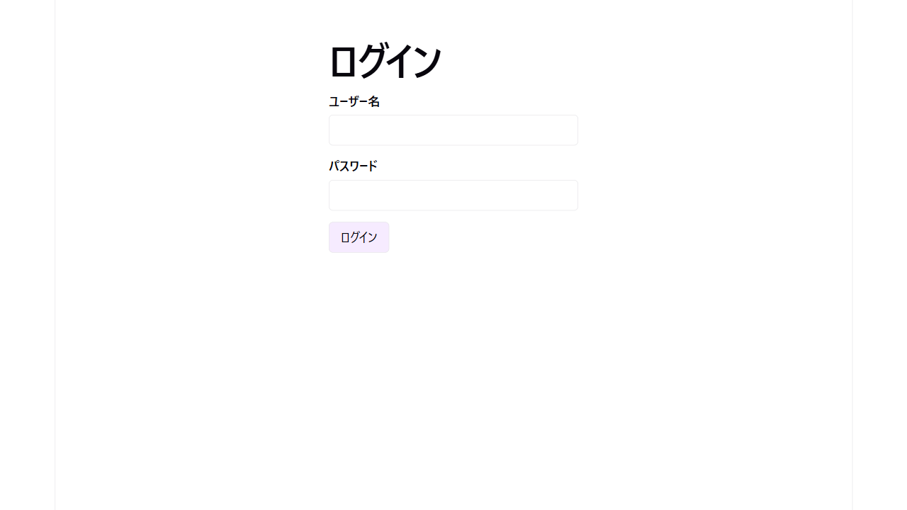
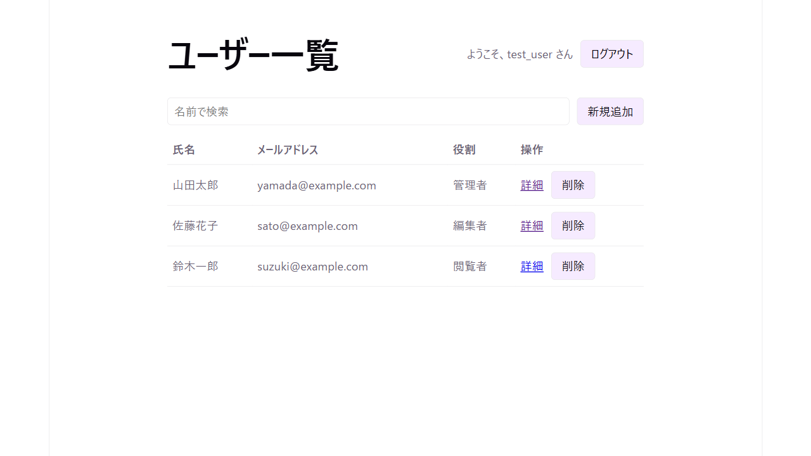
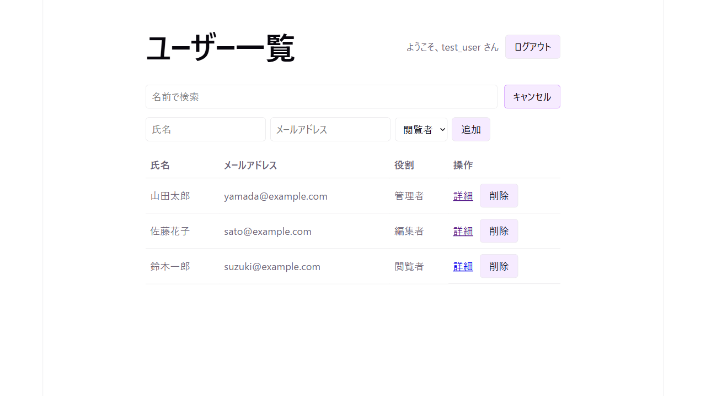
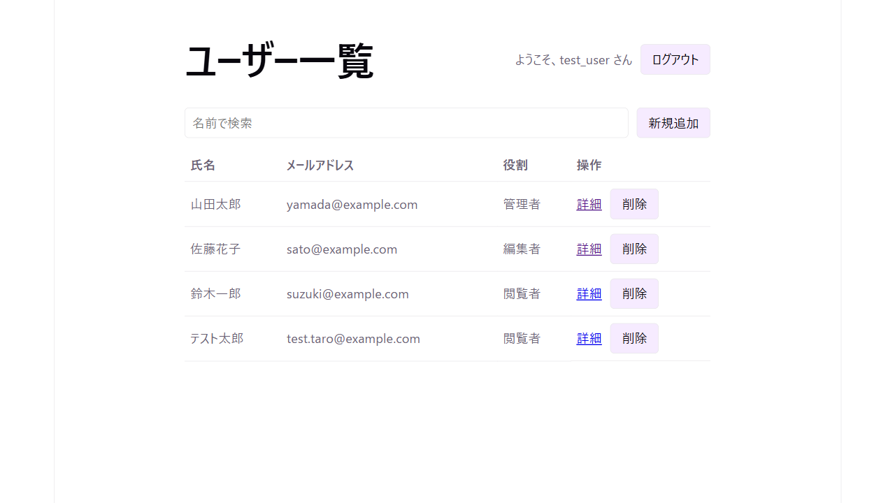
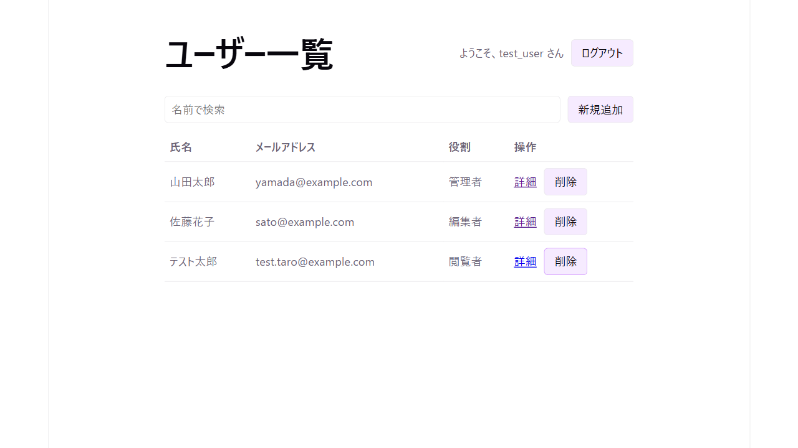
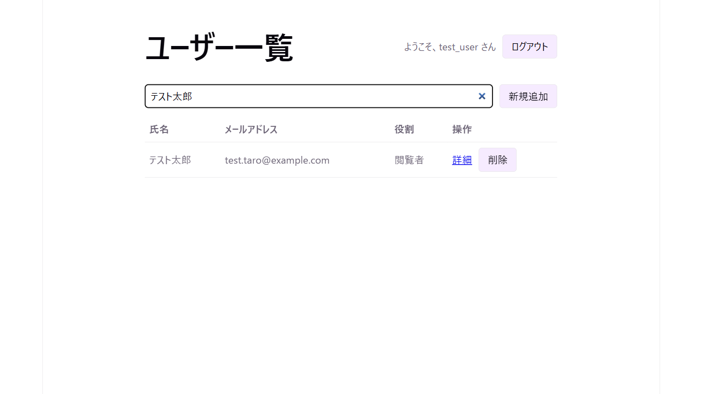
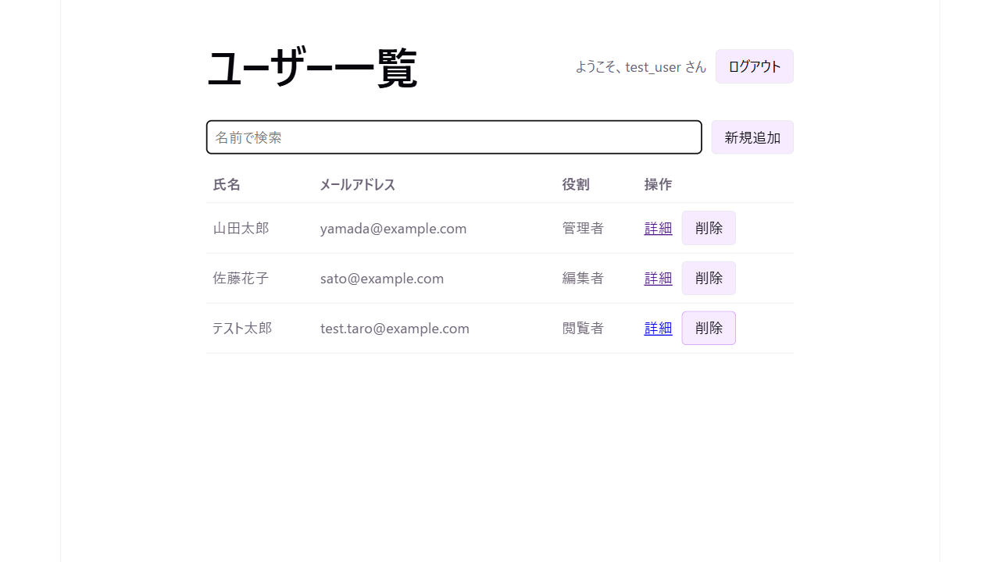

| テストNo. | 操作手順 | 期待結果 | 合否 |
| --- | --- | --- | --- |
| 1-1 | `http://localhost:5173/` にアクセスする | ログイン画面(`/login`)にリダイレクトされる | OK |
| 1-2 | ユーザー名「test_user」、パスワード「pass1234」を入力し「ログイン」を押す | ログインに成功し、ユーザー一覧画面(`/users`)へ遷移する | OK |
| 1-3 | 「新規追加」を押す | 氏名・メールアドレス・役割の入力フォームが表示される | OK |
| 1-4 | 氏名「テスト太郎」、メールアドレス「test.taro@example.com」、役割「閲覧者」を入力し「追加」を押す | 一覧に「テスト太郎」が追加表示される | OK |
| 1-5 | 既存ユーザー「鈴木一郎」の行の「削除」を押す | 確認ダイアログ「「鈴木一郎」を削除しますか？」が表示される | OK |
| 1-6 | 確認ダイアログで「OK」を押す | 「鈴木一郎」が一覧から削除される | OK |
| 2-1 | 検索欄に「テスト太郎」と入力する | 一覧が絞り込まれ、「テスト太郎」のみ表示される | OK |
| 2-2 | 検索欄を空にする | 全ユーザーが再表示され、削除済みの「鈴木一郎」は表示されない | OK |

## エビデンス

### 1-1

### 1-2

### 1-3

### 1-4

### 1-5

確認ダイアログ「「鈴木一郎」を削除しますか？」はネイティブダイアログのためスクリーンショット取得不可。ツールログ上でメッセージ内容を確認済み。

### 1-6

### 2-1

### 2-2

